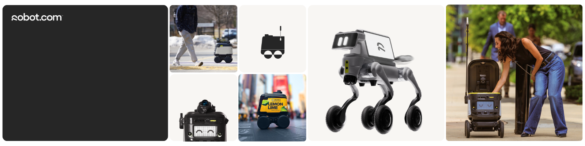
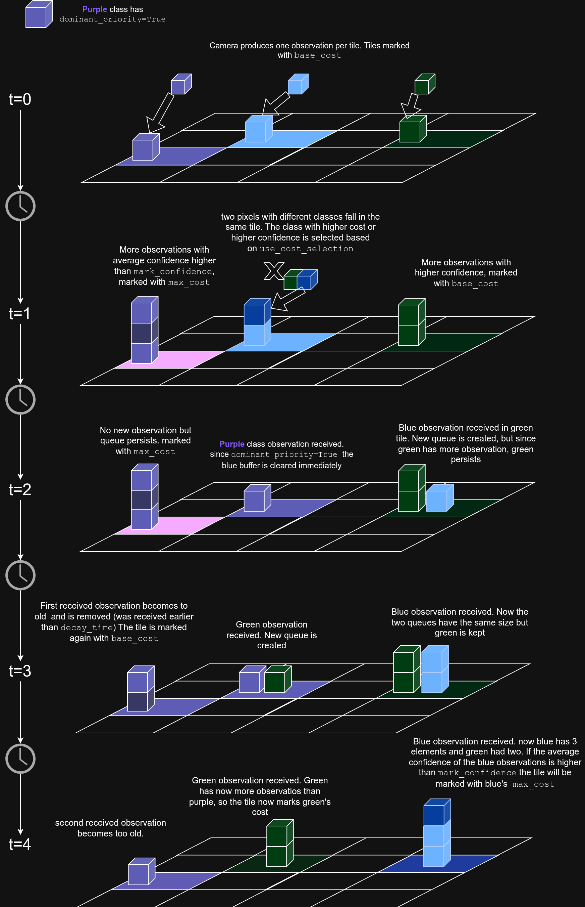

# Semantic Segmentation Layer

A custom nav2 costmap layer plugin inspired on stvl, that integrates semantic segmentation data into the navigation costmap. It was developed by [@pepisg](https://github.com/pepisg) and [@sunart24](https://github.com/sunart24) at [robot.com](robot.com)

## Overview

This plugin is designed for **RGBD sensors** (depth cameras with semantic segmentation) and populates the costmap with segmentation masks, aligned pointclouds containing the x, y, and z coordinates of each pixel in the mask, and optionally confidence masks that contain the inference confidence of each pixel. The aligned pointcloud is essential for mapping image pixels to costmap tiles in 3D space. It is a custom made plugin that integrates with the Nav2 navigation stack.

For a detailed example on how to use the layer, refer to the [nav2_segmentation_demo](https://github.com/pepisg/nav2_segmentation_demo) repo, which shows how to create simple ML models and run them on gazebo simulations.


## Key Concepts

### Observations

An **observation** is a single piece of semantic information received from the camera at a specific point in time. Each observation contains:
- **Class ID**: The semantic class detected (e.g., "grass", "sidewalk")
- **Confidence**: The neural network's inference confidence for that classification (0-255)
- **Timestamp**: When the observation was received

Observations are **accumulated spatially** on costmap tiles - multiple observations at different times can be recorded for the same physical location. They are **tracked temporally** - each observation has a timestamp and will be automatically removed (decayed) when it becomes older than the configured `tile_map_decay_time`.

### Queues

A **queue** (or rolling buffer) is a time-ordered collection of observations for a specific semantic class on a specific costmap tile. Think of it as a history log that answers: "What observations of class X have we seen at this location in the last N seconds?"

Each queue:
- Stores observations in chronological order (oldest to newest)
- Automatically removes observations that are older than `tile_map_decay_time`
- Maintains a running sum of confidence values for efficient cost calculation
- Belongs to exactly one semantic class on one tile

**Key insight**: Each tile maintains **multiple queues** - one per semantic class that has ever been observed at that location. This allows the plugin to track competing semantic interpretations of the same physical space over time.

## How It Works

### Architecture

Each tile in the costmap maintains **multiple observation queues** - one queue per semantic class that has been observed on that tile. However, only the **dominant class** (the class with special priority or the most observations) determines the cost value assigned to that tile at any given time. This architecture allows the plugin to track competing observations while ensuring navigation safety by prioritizing certain classes (e.g., obstacles) over others (e.g., traversable terrain).


At a high level, this layer works as follows:

1. **Pixel to Costmap Matching**: For each incoming camera frame, the aligned pointcloud is used to project each segmentation mask pixel into 3D world coordinates and map it to a costmap tile based on its (x, y) position. When multiple pixels from the same frame map to the same tile, only one observation is kept per tile. The observation is selected based on either highest `max_cost` (cost-based selection) or highest confidence (confidence-based selection), controlled by the `use_cost_selection` parameter.

2. **Multiple Queues per Tile**: Each costmap tile maintains multiple queues, one for each semantic class observed at that spatial location. Each queue stores observations received over the last N seconds, preserving the temporal history of that class at that location.

3. **Dominant Class Selection**: At any given time, one class is designated as the "dominant class" for the tile - this is the class whose cost value is applied to that tile in the costmap. When a new observation arrives on a tile with existing observations from previous frames:
   - Classes with `dominant_priority=True` immediately become dominant and **clear all queues of other classes** from that tile
   - Classes with `dominant_priority=False` only become dominant if their queue accumulates **more observations** than the current dominant class's queue

4. **Cost Assignment**: The cost applied to each tile is determined by the dominant class:
   - **Base cost**: When a single observation of the dominant class exists, the tile is marked with the class's `base_cost`
   - **Max cost**: When the dominant class has accumulated `samples_to_max_cost` observations with an average confidence above `mark_confidence`, the tile is marked with the class's `max_cost`

5. **Temporal Decay**: As time passes, observations are continuously checked against their timestamps. When an observation becomes older than `tile_map_decay_time`, it is automatically purged from its queue. This temporal decay ensures the costmap reflects recent information rather than stale data. If the dominant class queue becomes empty due to decay, a new dominant class is recomputed from the remaining non-empty queues at that tile.

### Visual Explanation

The image below provides a visual explanation of how the plugin works. In this diagram, purple and green represent different segmentation classes for each observation, while the darkness of the color maps to the confidence of the observation. Each vertical stack of cubes on a tile represents the multiple queues maintained for that tile, with the tallest/darkest stack indicating the dominant class.



- **t=0**: Camera produces one observation per tile. Each tile starts with a single observation in its first queue, marked with that class's `base_cost`
- **t=1**: 
  - Left tile (purple): Accumulates more observations with average confidence above `mark_confidence`, now marked with `max_cost`
  - Middle tile: Two pixels with different classes fall on the same tile - the one with higher `max_cost` or higher confidence is selected based on `use_cost_selection`, blue wins
  - Right tile (green): Receives more observations with higher confidence, still marked with `base_cost`
- **t=2**: 
  - Left tile (purple): No new observation but queue persists at `max_cost`
  - Middle tile: Purple observation arrives with `dominant_priority=True`, immediately clears the blue queue and takes over
  - Right tile: Blue observation arrives, creates a new queue alongside green, but green remains dominant (has more observations)
- **t=3**: 
  - Left tile (purple): First received observation becomes too old and is removed (was received earlier than `tile_map_decay_time`). The tile is marked again with `base_cost` since fewer observations remain
  - Middle tile: Green observation arrives, creates a new queue but purple remains dominant
  - Right tile: Blue observation arrives. Both queues now have same size, but green remains dominant (was already dominant)
- **t=4**: 
  - Left tile (purple): Second received observation becomes too old and is removed. Queue continues to decay
  - Middle tile: Green observation arrives. Green queue now has more observations than purple, so green becomes dominant and the tile marks green's cost. Purple has been purged by green
  - Right tile: Blue observation arrives. Blue queue now has 3 observations vs green's 2. If blue's average confidence exceeds `mark_confidence`, tile is marked with blue's `max_cost`

## Required Topics and Message Types

- **`segmentation_topic`**: [`sensor_msgs/Image`](https://docs.ros2.org/latest/api/sensor_msgs/msg/Image.html) (mono8) - Semantic segmentation mask where each pixel value is a class ID. QoS: sensor data (best effort).
- **`pointcloud_topic`**: [`sensor_msgs/PointCloud2`](https://docs.ros2.org/latest/api/sensor_msgs/msg/PointCloud2.html) - Aligned 3D pointcloud providing (x,y,z) world coordinates for each segmentation pixel. Must be pixel-aligned and time-synchronized with segmentation. QoS: sensor data (best effort).
- **`confidence_topic`** (optional): [`sensor_msgs/Image`](https://docs.ros2.org/latest/api/sensor_msgs/msg/Image.html) (mono8) - Per-pixel neural network confidence values (0-255). Must be time-synchronized with segmentation and pointcloud. QoS: sensor data (best effort).
- **`labels_topic`**: [`vision_msgs/LabelInfo`](https://github.com/ros-perception/vision_msgs/blob/ros2/msg/LabelInfo.msg) - Mapping between class names and class IDs. Must be published before segmentation processing begins. QoS: reliable, transient local.

## Configuration

Below is a sample configuration for the plugin with the more relevant parameters commented:

```yaml
semantic_segmentation_layer:
  plugin: "semantic_segmentation_layer::SemanticSegmentationLayer"
  enabled: True
  observation_sources: camera
  camera:
    segmentation_topic: "/segmentation/mask"
    confidence_topic: "/segmentation/confidence"
    labels_topic: "/segmentation/label_info"
    pointcloud_topic: "/rgbd_camera/depth/points"
    observation_persistence: 0.0
    expected_update_rate: 0.0
    visualize_tile_map: False
    use_cost_selection: False  # If true, select observation per tile using highest max_cost in case multile observations fall in a single tile on one image. If false, use highest confidence
    max_obstacle_distance: 5.0
    min_obstacle_distance: 0.3
    tile_map_decay_time: 5.0
    class_types: ["traversable", "danger"]
    
    traversable:
      classes: ["sidewalk"]
      base_cost: 0              # Cost when a single observation is received
      max_cost: 0               # Cost when samples_to_max_cost observations with mark_confidence are accumulated
      mark_confidence: 0        # Average confidence threshold to apply max_cost
      samples_to_max_cost: 0    # Number of observations needed to apply max_cost
      dominant_priority: False  # If true, this class immediately becomes dominant and clears all other class queues from the tile
    
    danger:
      classes: ["grass"]
      base_cost: 254            # Cost when a single observation is received
      max_cost: 254             # Cost when samples_to_max_cost observations with mark_confidence are accumulated
      mark_confidence: 0        # Average confidence threshold to apply max_cost
      samples_to_max_cost: 0    # Number of observations needed to apply max_cost
      dominant_priority: False  # If true, this class immediately becomes dominant and clears all other class queues from the tile
```

## Authors

- **[@pepisg](https://github.com/pepisg)** - <pepisg@robot.com>
- **[@sunart24](https://github.com/sunart24)** - <sunart24@robot.com>

## Acknowledgments

This plugin draws inspiration from the [Spatio-Temporal Voxel Layer](https://github.com/SteveMacenski/spatio_temporal_voxel_layer), extending the concept of temporal buffering to semantic segmentation data with multi-class queue management.

## Motivation

This plugin was created as an alternative to include semantic segmentation data in nav2, which is an important perception source when traversability is not based only on geometric features (obstacles), but also on the characteristics of the surfaces robots encounter while moving.

## Citation

If you use this plugin in your research or project, please cite it as:

```bibtex
@software{semantic_segmentation_layer,
  author = {Gonzale, Pedro and Solarte, Johan},
  title = {Semantic Segmentation Layer: A Nav2 Costmap Plugin for RGBD Semantic Segmentation},
  year = {2026},
  url = {https://github.com/kiwicampus/semantic_segmentation_layer}
}
```

## Contributing

Contributions are welcome! If you'd like to contribute:

1. Fork the repository
2. Create a feature branch (`git checkout -b feature/amazing-feature`)
3. Commit your changes (`git commit -m 'Add amazing feature'`)
4. Push to the branch (`git push origin feature/amazing-feature`)
5. Open a Pull Request

## License

This project is licensed under the MIT License. See the [LICENSE](LICENSE) file for details.

